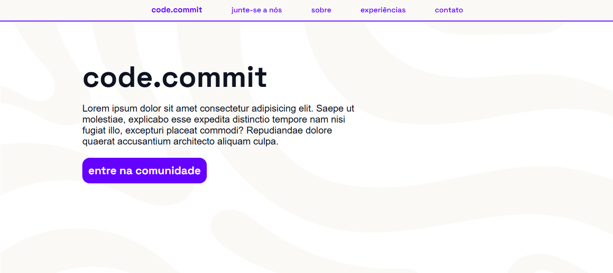

# code.commit

### 💜 Sobre o Projeto
Este é um projeto de uma landing page fictícia para uma comunidade de programadores, chamada code.commit.
O objetivo é treinar minhas habilidades em HTML e CSS.

### 📄 Status do Projeto
O projeto ainda está **em desenvolvimento**.
Imagem do projeto:

### 💭 Sugestões
Sugestões e feedbacks são bem-vindos!
Você pode entrar em contato comigo pelo [meu LinkedIn](www.linkedin.com/in/matheussilvabueno)
